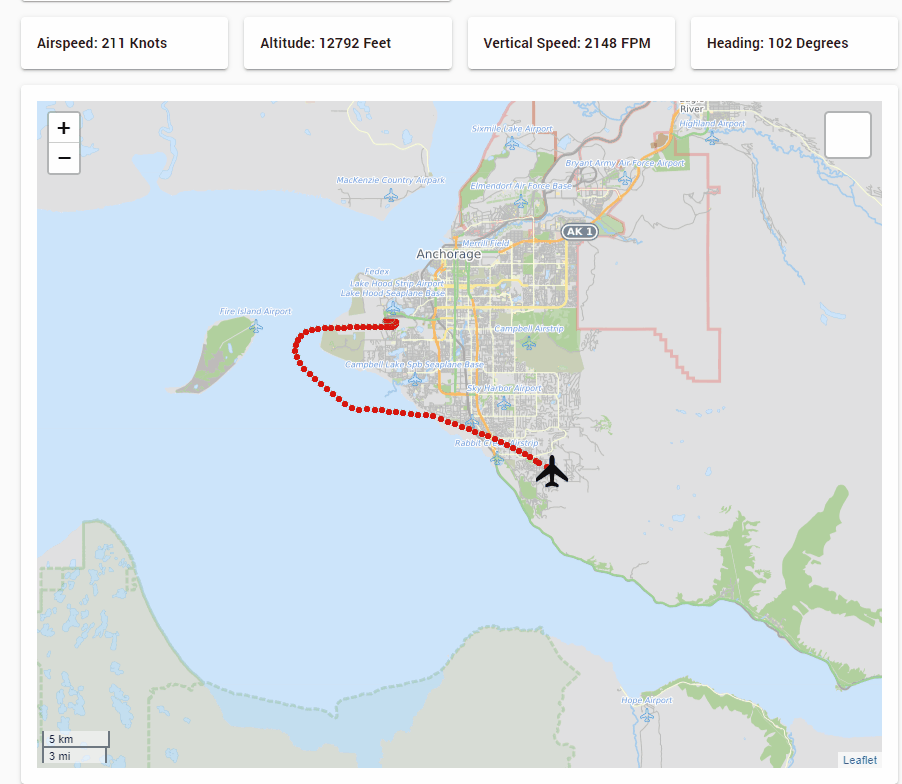

# UDMSFS
Universal Dashboard for Microsoft Flight Simulator 2020... because why not?

This utilizes the [Python SimConnect Package](https://github.com/hankhank10/MSFS2020-cockpit-companion) to provide REST values to a PowerShell dashboard built with [Universal Dashboard](https://ironmansoftware.com/powershell-universal-dashboard)

# Components

* [Python SimConnect - Cockpit Companion](https://github.com/hankhank10/MSFS2020-cockpit-companion)
* [Universal Dashboard](https://ironmansoftware.com/powershell-universal-dashboard)

